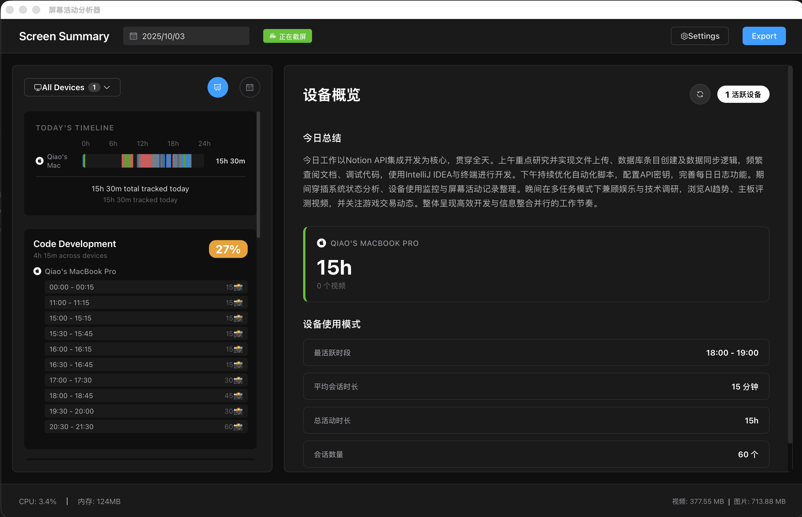
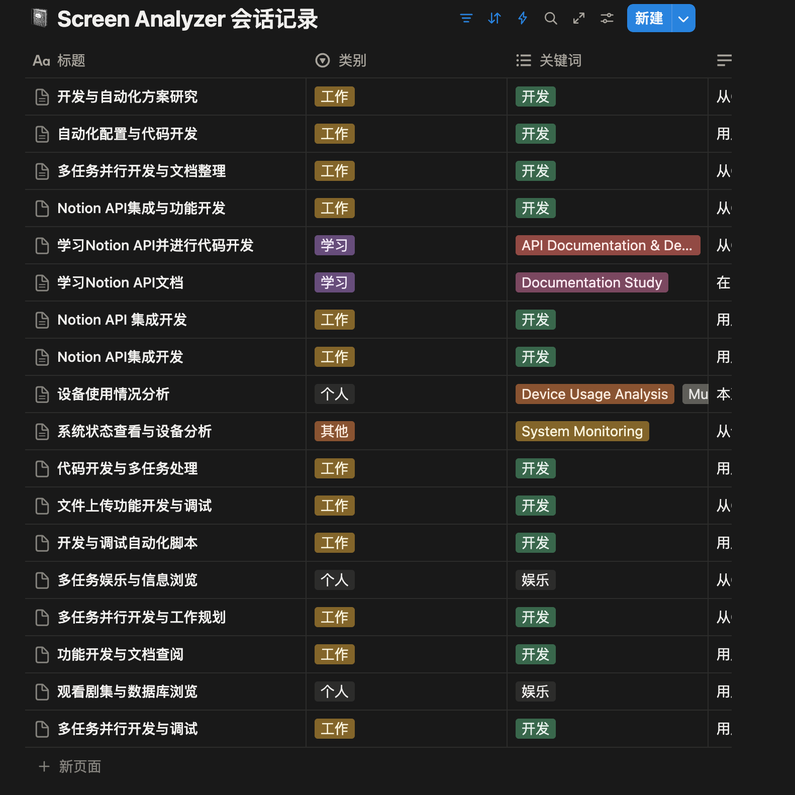

# 屏幕活动分析器 (Screen Analyzer)

## 特别鸣谢 🙏

**本项目的灵感来源于开源项目 [Dayflow](https://github.com/JerryZLiu/Dayflow)**，感谢 JerryZLiu 的创意和分享！Dayflow 的设计理念给了我们很大的启发，帮助我们打造了这款更适合本地使用的屏幕活动分析工具。

> 🤖 **本项目采用 Claude Code + Codex 混合编程方式开发，0人工手搓代码，完全由 AI 驱动实现。**

## 项目简介

屏幕活动分析器是一款基于 Tauri + Vue 3 + Rust 开发的跨平台桌面应用，旨在通过智能化的方式自动记录、分析和总结您的日常屏幕活动。

## 效果展示

<p align="center">
  
  <br/>
  <em>主界面 - 日历视图、时间线和每日总结</em>
</p>

<p align="center">
  
  <br/>
  <em>Notion 集成 - 自动同步会话记录到 Notion 数据库</em>
</p>

<p align="center">
  
  <br/>
  <em>Notion 屏幕总结 - 详细的活动分析和时间记录</em>
</p>

### 核心功能

#### 基础功能
- 🎬 **自动截屏录制**：每秒自动捕获屏幕，记录您的工作状态
- 🤖 **AI 智能分析**：多 LLM 提供商支持
  - 🌟 **Claude Agent**：支持 Claude 官方订阅账号（无需 API Key）
  - 🇨🇳 **国内大模型**：支持 Kimi、GLM-4 等兼容 Claude Agent 的模型
  - 🔧 **通义千问**：阿里云通义千问 VL 多模态模型
- 📹 **视频生成**：将截屏序列生成时间线视频，支持快速回顾
- 📊 **活动时间线**：可视化展示一天的工作流程和活动分布
- 🗂️ **自动分类**：智能识别工作、学习、娱乐等不同活动类型
- 🧹 **存储管理**：自动清理过期数据，默认保留7天记录
- 🔒 **隐私保护**：所有数据本地存储，不上传云端

#### 高级功能
- 🔗 **Notion 集成**：自动同步视频和总结到 Notion 数据库
- 📱 **多屏幕支持**：完美支持 macOS 多显示器截图
- 🖥️ **系统监控**：实时显示 CPU 和内存使用情况
- 🌙 **锁屏检测**：自动跳过锁屏时的黑屏帧，节省存储空间
- 🎨 **可配置分辨率**：支持 1080P/2K/4K/原始分辨率截图
- 💾 **数据库选择**：支持 SQLite（本地）和 MariaDB（远程）
- 🏷️ **标签系统**：手动添加和管理活动标签
- 📝 **日志查看器**：内置日志查看功能，方便调试

## ⚠️ 重要提示

### FFmpeg 二进制文件说明

由于 FFmpeg 二进制文件体积较大（超过 GitHub 100MB 限制），这些文件**不包含在源码仓库中**。如果您从源码编译运行，需要手动下载：

1. **下载地址**：
   - Windows: [官方下载](https://www.gyan.dev/ffmpeg/builds/) → 下载 `ffmpeg-release-essentials.zip`
   - macOS: [官方下载](https://evermeet.cx/ffmpeg/) 或通过 `brew install ffmpeg`
   - Linux: 通过包管理器安装 (`apt/dnf/pacman install ffmpeg`)

2. **放置位置**：
   ```
   src-tauri/resources/ffmpeg/
   ├── windows/ffmpeg.exe
   ├── macos/ffmpeg
   └── linux/ffmpeg
   ```

3. **详细说明**：请参阅 [`src-tauri/resources/ffmpeg/README.md`](src-tauri/resources/ffmpeg/README.md)

> 💡 **提示**：如果您只是想使用应用，请直接下载 [Releases](https://github.com/deletexiumu/screen-analyzer/releases) 中的安装包，已包含所有必需文件。

## 系统要求

### 运行环境
- **操作系统**：macOS 10.15+ / Windows 10+ / Linux (Ubuntu 20.04+)
- **内存**：建议 8GB 及以上
- **存储空间**：至少 10GB 可用空间（用于存储截图和视频）
- **FFmpeg**：应用已内置，无需单独安装（如需使用系统FFmpeg，请确保已安装）

### 开发环境
- Node.js 18.0+
- Rust 1.70+
- pnpm/npm/yarn 包管理器

## 快速开始

### 下载安装包

前往 [Releases](https://github.com/yourusername/screen-analyzer/releases) 页面下载对应平台的安装包：

- **macOS**: `Screen-Analyzer_x.x.x_universal.dmg`
- **Windows**: `Screen-Analyzer_x.x.x_x64-setup.exe`
- **Linux**: `screen-analyzer_x.x.x_amd64.AppImage`

### 源码编译

#### 1. 克隆项目
```bash
git clone https://github.com/yourusername/screen-analyzer.git
cd screen-analyzer
```

#### 2. 安装依赖
```bash
# 安装前端依赖
npm install

# 安装 Rust 依赖（如未安装 Rust）
curl --proto '=https' --tlsv1.2 -sSf https://sh.rustup.rs | sh
```

#### 3. 配置 FFmpeg（可选）
应用已内置 FFmpeg，如需使用内置版本：
1. 下载对应平台的 FFmpeg 二进制文件
2. 放置到 `src-tauri/resources/ffmpeg/[platform]/` 目录
3. 详见 `src-tauri/resources/README.md`

#### 4. 开发模式运行
```bash
npm run tauri dev
```

#### 5. 构建生产版本

**macOS**:
```bash
npm run tauri build -- --target universal-apple-darwin
```

**Windows**:
```bash
npm run tauri build -- --target x86_64-pc-windows-msvc
```

**Linux**:
```bash
npm run tauri build -- --target x86_64-unknown-linux-gnu
```

构建完成后，安装包会生成在 `src-tauri/target/release/bundle/` 目录下。

## 配置说明

### 首次启动配置

1. **授予权限**（macOS）
   - 首次启动需要授予"屏幕录制"权限
   - 系统偏好设置 → 安全性与隐私 → 隐私 → 屏幕录制

2. **配置 LLM API**

   **选项 1: Claude Agent（推荐）**
   - 打开设置界面 → AI 设置
   - 选择 "Claude" 作为提供商
   - 模型选择：
     - `claude-sonnet-4-5` 或 `claude-opus-4-1`（官方模型，需 Claude 订阅）
     - `kimi`（月之暗面 Kimi）
     - `glm-4-plus` 或 `glm-4-air`（智谱 AI）
     - 或手动输入其他兼容 Claude Agent 的模型名称
   - API Key 配置（可选）：
     - 留空：使用 Claude CLI 登录的订阅账号凭据
     - 填写：使用自定义 API Key（国内模型通常需要）
   - 点击"测试连接"验证配置

   **选项 2: 通义千问**
   - 选择 "通义千问 (Qwen)" 作为提供商
   - 在[阿里云DashScope](https://dashscope.console.aliyun.com/)获取 API Key
   - 输入 API Key 和模型配置
   - 测试连接

3. **配置 Notion 集成**（可选）
   - 在 [Notion Integrations](https://www.notion.so/my-integrations) 创建集成并获取 API Token
   - 在应用设置中输入 Notion API Token
   - 配置数据库 ID（用于存储活动记录）
   - 启用自动同步功能

4. **数据库配置**（可选）
   - 默认使用本地 SQLite 数据库
   - 如需远程存储，可配置 MariaDB/MySQL 连接
   - 支持自动迁移和时区转换

5. **截屏分辨率配置**
   - 选择截屏分辨率：1080P / 2K / 4K / 原始分辨率
   - 调整图片质量（1-100）
   - 配置黑屏检测阈值（自动跳过锁屏黑屏）

### 配置文件位置

- **macOS**: `~/Library/Application Support/com.cookie.screen-analyzer/`
- **Windows**: `%APPDATA%\com.cookie.screen-analyzer\`
- **Linux**: `~/.config/com.cookie.screen-analyzer/`

配置文件说明：
- `config.json`: 应用配置
- `data.db`: SQLite 数据库
- `frames/`: 截图存储目录
- `videos/`: 生成的视频文件

## 开机启动设置

### macOS

1. 打开"系统偏好设置" → "用户与群组"
2. 选择当前用户，点击"登录项"标签
3. 点击"+"按钮，选择 Screen Analyzer 应用
4. 勾选"隐藏"选项（可选）

### Windows

1. 按 `Win + R`，输入 `shell:startup`
2. 将 Screen Analyzer 快捷方式复制到打开的文件夹
3. 或在应用设置中启用"开机自启动"选项

### Linux

创建 systemd 服务文件：
```bash
# 创建服务文件
sudo nano /etc/systemd/system/screen-analyzer.service

# 添加以下内容
[Unit]
Description=Screen Analyzer
After=graphical.target

[Service]
Type=simple
ExecStart=/usr/local/bin/screen-analyzer
Restart=always
User=YOUR_USERNAME

[Install]
WantedBy=default.target

# 启用服务
sudo systemctl enable screen-analyzer
sudo systemctl start screen-analyzer
```

## 使用指南

### 基本操作

1. **查看活动记录**
   - 在日历视图中选择日期
   - 查看当天的活动时间线
   - 点击活动卡片查看详情

2. **生成回顾视频**
   - 选择会话
   - 点击"生成视频"按钮
   - 设置播放速度（默认4倍速）

3. **手动分析**
   - 点击"分析"按钮触发 AI 分析
   - 支持重新分析特定会话
   - 查看每日总结和活动分析

4. **标签管理**
   - 手动添加自定义标签
   - 编辑和删除已有标签
   - 按标签过滤和搜索活动

5. **Notion 同步**
   - 自动将视频和总结同步到 Notion
   - 手动触发同步特定会话
   - 查看同步状态和历史

6. **系统监控**
   - 查看底部状态栏的 CPU 和内存使用情况
   - 监控截屏和分析任务状态
   - 查看应用日志

7. **数据管理**
   - 在设置中调整保留天数（最多30天）
   - 手动触发存储清理
   - 导出和备份数据

### 快捷键

- `Cmd/Ctrl + ,`: 打开设置
- `Cmd/Ctrl + R`: 刷新数据
- `Cmd/Ctrl + Q`: 退出应用
- `Space`: 暂停/恢复截屏

## 隐私与安全

- ✅ **完全本地化**：所有数据存储在本地，不会上传到任何服务器
- ✅ **数据加密**：敏感配置信息加密存储
- ✅ **自动清理**：过期数据自动删除，防止占用过多空间
- ✅ **权限控制**：仅在用户授权后才能访问屏幕内容

## 常见问题

### Q: 应用占用空间太大怎么办？
A: 可以在设置中减少保留天数，或手动清理历史数据。建议保留3-7天的数据。

### Q: 如何使用 Claude Agent？
A:
**使用 Claude 官方订阅账号：**
1. 确保已登录 Claude CLI（运行 `claude login`）
2. 在应用设置中选择 "Claude" 提供商
3. 选择官方模型（如 `claude-sonnet-4-5`）
4. **API Key 留空**
5. 测试连接 - 应用会自动使用 CLI 登录凭据

**使用国内大模型（Kimi、GLM-4 等）：**
1. 在对应平台获取 API Key：
   - Kimi: [月之暗面开放平台](https://platform.moonshot.cn/)
   - GLM-4: [智谱开放平台](https://open.bigmodel.cn/)
2. 在应用设置中选择 "Claude" 提供商
3. 选择或手动输入模型名称（如 `kimi`、`glm-4-plus`）
4. 填写 API Key
5. 测试连接

**提示**：Claude Agent SDK 提供了统一的接口，支持所有兼容 Claude Agent 协议的模型。

### Q: 为什么 AI 分析失败？
A: 请检查：
1. **Claude**:
   - 如使用订阅账号：确保已运行 `claude login` 登录
   - 如使用 API Key：检查 Key 是否正确且有余额
   - 确保选择了正确的模型名称
2. **通义千问**:
   - API Key 是否正确配置
   - 网络连接是否正常
   - API 额度是否充足
3. 查看应用日志了解详细错误信息

### Q: macOS 提示没有权限？
A: 需要在系统偏好设置中授予"屏幕录制"权限，授权后需要重启应用。

### Q: 视频生成失败？
A:
1. 应用已内置 FFmpeg，如果仍然失败请检查：
   - 确保 `src-tauri/resources/ffmpeg/` 目录下有对应平台的FFmpeg文件
   - Windows: `ffmpeg.exe`，macOS/Linux: `ffmpeg`
2. 检查截图文件是否存在
3. 确保会话有对应的截图帧

### Q: 如何配置 Notion 集成？
A:
1. 访问 [Notion Integrations](https://www.notion.so/my-integrations) 创建新的集成
2. 复制 Internal Integration Token
3. 在 Notion 中创建一个数据库，并分享给你的集成
4. 在应用设置中配置 Token 和数据库 ID
5. 启用自动同步

### Q: 多屏幕截图不工作？
A:
1. 确保在系统设置中授予了屏幕录制权限
2. macOS 用户需要重启应用以生效
3. 检查设置中是否选择了正确的显示器
4. 查看应用日志了解详细错误信息

### Q: 黑屏检测如何工作？
A:
- 应用会自动检测锁屏时的黑色帧
- 当检测到黑屏（可配置阈值）时，自动跳过该帧
- 节省存储空间，避免记录无用的黑屏内容
- 可在设置中调整黑屏检测的敏感度

### Q: 如何使用远程数据库（MariaDB）？
A:
1. 在设置中切换到 MariaDB 模式
2. 配置数据库连接信息（主机、端口、用户名、密码、数据库名）
3. 测试连接
4. 应用会自动迁移本地数据到远程数据库
5. 支持多设备数据同步

### Q: CPU 和内存占用过高？
A:
1. 降低截屏分辨率（如从 4K 降到 1080P）
2. 减少图片质量设置
3. 增加截屏间隔（从 1 秒改为 2-3 秒）
4. 关闭不必要的后台分析任务
5. 查看底部状态栏监控资源使用情况

## 技术栈

### 前端
- **框架**: Vue 3.5+ (Composition API)
- **构建工具**: Vite 6.0+
- **UI 库**: Element Plus 2.11+
- **状态管理**: Pinia 3.0+
- **工具库**: VueUse, Day.js

### 后端
- **框架**: Tauri 2.x
- **语言**: Rust (Edition 2021)
- **异步运行时**: Tokio (Actor 模型 + 事件驱动架构)
- **数据库**:
  - SQLx (支持 SQLite 和 MariaDB/MySQL)
  - 自动迁移和时区转换

### 核心功能模块
- **截屏**: screenshots crate (跨平台)
- **图像处理**: image crate (压缩、缩放、黑屏检测)
- **视频生成**: FFmpeg (内置二进制)
- **LLM 集成**:
  - **Claude Agent SDK**: 支持 Claude 官方订阅和兼容模型
    - 官方模型：Claude Sonnet 4.5、Claude Opus 4.1
    - 国内模型：Kimi（月之暗面）、GLM-4（智谱 AI）
    - 支持自定义模型（兼容 Claude Agent 协议）
  - **通义千问 (Qwen)**: 阿里云多模态视觉模型
  - **插件化架构**: 易于扩展新的 LLM 提供商
- **Notion API**: reqwest + multipart
- **系统监控**: sysinfo (CPU、内存)
- **日志**: tracing + tracing-subscriber

## 贡献指南

欢迎提交 Issue 和 Pull Request！

1. Fork 本仓库
2. 创建特性分支 (`git checkout -b feature/AmazingFeature`)
3. 提交更改 (`git commit -m 'Add some AmazingFeature'`)
4. 推送到分支 (`git push origin feature/AmazingFeature`)
5. 提交 Pull Request

## 开源协议

本项目采用 [MIT License](LICENSE) 开源协议。

## 致谢

- [Dayflow](https://github.com/JerryZLiu/Dayflow) - 项目灵感来源
- [Tauri](https://tauri.app/) - 跨平台框架
- [Vue.js](https://vuejs.org/) - 前端框架
- [通义千问](https://tongyi.aliyun.com/) - AI 分析支持

## 联系方式

- 项目主页: [https://github.com/deletexiumu/screen-analyzer](https://github.com/yourusername/screen-analyzer)
- Issue 反馈: [https://github.com/deletexiumu/screen-analyzer/issues](https://github.com/yourusername/screen-analyzer/issues)

---

<div align="center">
  <sub>使用 ❤️ 和 AI 构建</sub>
</div>